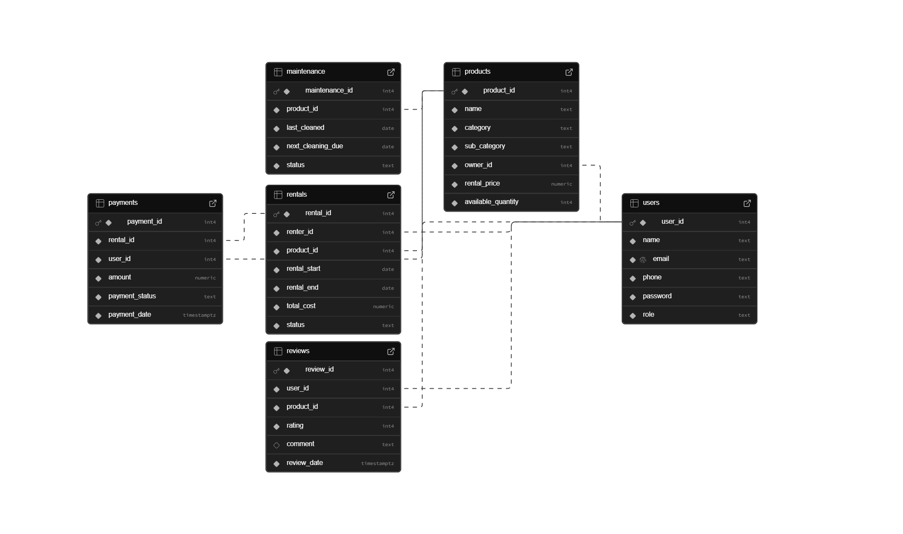

# Lend It - Full-Stack Rental Marketplace 🛍️

[cite_start]Lend It is a web-based rental marketplace where users can rent high-value clothing and accessories at an affordable price[cite: 182]. [cite_start]The platform enables individuals to list their products for rent and facilitates seamless transactions, ensuring quality and security[cite: 183].



## ✨ Key Features

* **Role-Based Access Control**: Separate experiences for Renters, Owners, and Admins.
* **Product Catalog**: Users can list products with categories, pricing, and availability.
* **Advanced Search & Filtering**: The platform supports numerous complex queries to find specific products or user data.
* **Rental Workflow**: Manage the entire rental lifecycle from booking to completion or cancellation.
* **Reviews and Ratings**: Users can leave reviews and ratings on products to build trust.
* **Maintenance Tracking**: A system to track product cleaning and maintenance cycles.

## 🛠️ Tech Stack

* **Backend**: Flask, SQLAlchemy
* **Database**: MySQL
* **Frontend**: HTML, CSS (Jinja2 for templating)
* **Deployment**: The application is designed to be deployed on a WSGI server.

## 🚀 Setup and Installation

To run this project locally, follow these steps:

1.  **Clone the repository:**
    ```bash
    git clone <your-repo-url>
    cd Lend-It-Project
    ```

2.  **Create and activate a virtual environment:**
    ```bash
    python -m venv venv
    source venv/bin/activate  # On Windows, use `venv\Scripts\activate`
    ```

3.  **Install the dependencies:**
    ```bash
    pip install -r requirements.txt
    ```

4.  **Set up the database:**
    * Make sure you have MySQL server running.
    * Open `app.py` and update the `SQLALCHEMY_DATABASE_URI` with your MySQL username, password, and host.
    * Connect to your MySQL instance and run the scripts in the `/database` folder to create the schema and populate it with sample data.

5.  **Run the application:**
    ```bash
    flask run
    ```
    The application will be available at `http://127.0.0.1:5000`.

## 🧑‍💻 Team Members

* [cite_start]Vikram Mantri [cite: 132]
* [cite_start]Vansh Goyal [cite: 133]
* [cite_start]Nihal [cite: 134]
* [cite_start]Rishita Dhankar [cite: 135]